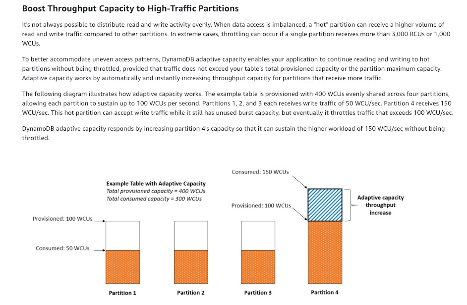
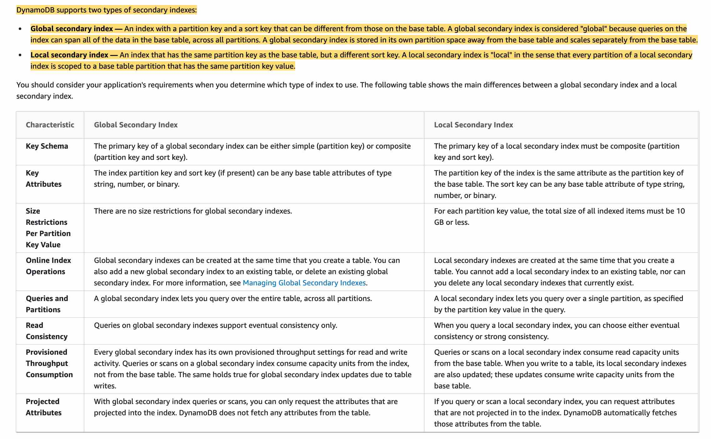

AWS DEVELOPER ASSOCIATE (DVA-C02) EXAM NOTES - David Galera, December 2024
- [CLI](#cli)
- [EBS](#ebs)
- [S3](#s3)
- [IAM](#iam)
- [Amazon Inspector](#amazon-inspector)
- [AWS Trusted Advisor](#aws-trusted-advisor)
- [Cloudfront](#cloudfront)
- [CDK](#cdk)
- [ECS](#ecs)
- [SNS](#sns)
- [SQS](#sqs)
- [KMS](#kms)
- [Parameter store](#parameter-store)
- [Secrets Manager](#secrets-manager)
- [Kinesis](#kinesis)
- [CodeCommit](#codecommit)
- [CodeBuild](#codebuild)
- [CodeDeploy](#codedeploy)
- [CodePipeline](#codepipeline)
- [Application Load Balancer (ALB)](#application-load-balancer-alb)
- [Auto Scaling](#auto-scaling)
- [Beanstalk](#beanstalk)
- [Cloudwatch logs](#cloudwatch-logs)
- [Cloudwatch metrics](#cloudwatch-metrics)
- [CloudWatch Alarms](#cloudwatch-alarms)
- [Lambda](#lambda)
- [Step functions](#step-functions)
- [API Gateway](#api-gateway)
- [DynamoDB](#dynamodb)
- [ElastiCache](#elasticache)
- [RDS](#rds)
- [EC2](#ec2)
- [Cloudformation](#cloudformation)
- [SAM](#sam)
- [X-Ray](#x-ray)
- [CloudTrail](#cloudtrail)
- [Macie](#macie)

## CLI
- --dry-run: checks whether you have the required permissions for the action, without actually making the request, and provides an error response. If you have the **required permissions**, the error response is `DryRunOperation`, otherwise, it is `UnauthorizedOperation`

`--page-size` - You can use the --page-size option to specify that the AWS CLI requests a smaller number of items from each call to the AWS service. The CLI still retrieves the full list but performs a larger number of service API calls in the background and retrieves a smaller number of items with each call.

Make few API calls -> `--max-items` and `--starting-token`

## EBS
- gp2: minimum of 100 IOPS (at 33.33 GiB and below) and a maximum of 16,000 IOPS (at 5,334 GiB and above)

- io1 4-16 GiB, 100-64k(Nitro) IOPS, ratio IOPS/GB <= 50:1

## S3
SSE-KMS does NOT encrypt object metadata.

**Inventory** You can use it to audit and report on the **replication and encryption** status of your objects for business, compliance, and regulatory needs

**S3 Analytics**: Analyze **storage access patterns** to help you decide when to transition the right data to the right storage class

**Replication**
- Replicated objects RETAIN metadata
- SRR and CRR -> S3 bucket level, a shared prefix level, or an object level using S3 object tags
- Lifecycle actions are not replicated

**ACLs**, customers can grant specific permissions (i.e. READ, WRITE, FULL_CONTROL) to specific users for an individual bucket or object.

**Query String Authentication** also referred as **Pre-signed URL**

**S3 Object Ownership** has two settings: 1. Object writer – The uploading account will own the object. 2. Bucket owner preferred – The bucket owner will own the object if the object is uploaded with the bucket-owner-full-control canned ACL. Without this setting and canned ACL, the object is uploaded and remains owned by the uploading account.

**Access Analyzer for S3** helps review all buckets that have bucket access control lists (ACLs), bucket policies, or access point policies that grant public or shared access. Access Analyzer for S3 alerts you to buckets that are configured to allow access to anyone on the internet or other AWS accounts, including AWS accounts outside of your organization.

## IAM
**Access Analyzer**: You can set the scope for the analyzer to an **organization or an AWS account**. Identify unintended access to your resources and data, which is a security risk. Helps inspecting unused access to guide you toward least privilege.
When the **unused access analyzer is enabled**, IAM Access Analyzer continuously analyzes your accounts to identify unused access and creates a centralized dashboard with findings. The findings highlight unused roles, unused access keys for IAM users, and unused passwords for IAM users. 

## Amazon Inspector
Amazon Inspector is an automated security assessment service that helps improve the **security and compliance** of applications deployed on AWS. Amazon Inspector automatically assesses applications for exposure, vulnerabilities, and deviations from best practices.

## AWS Trusted Advisor
AWS Trusted Advisor is an online tool that provides you real-time guidance to help you provision your resources following AWS best practices on **cost optimization**, security, fault tolerance, service limits, and performance improvement.

## Cloudfront
Client - Cloudfront (HTTPS), Cloudfront - Backend/origin (HTTPS)
Origin protocol policy: **HTTPS Only** or **Match Viewer** (same proto as the viewer)

**Signed URL** is generated by our application with SDK, give access to 1 file. Give access to a **path**, no matter the origin (work for more than s3 origins). They are key-pairs, only root account can manage them. Can **filter by IP, path, date, expiration**. Can leverage caching features. 2 types of signers used to **sign URLS and cookies**:
1. **trusted key group** (recommended), can rotate keys. Generate public/key pair, private key is used by services to generate the URL and public key is used by Cloudfront to verify the URL, you can associate a high number of public keys with your CloudFront distribution. The public key can be regenerated from the private key. You create a **key group** and add up to 5 public keys, this group is what cloudfront references to allow EC2 (for example) to create signed URLs.
2. **Cloudfront key pair** (deprecated, must use root account), only can be created by the **root account**. Up to two active CloudFront key pairs per AWS account


**Signed Cookies** give access to multiple files, static URL.

Cost for **data out** varies per edge location. 3 price classes:
- Price Class all -> all regions, expensive.
- Price Class 200 -> almost all regions, exclude the most expensive ones.
- Price Class 100 -> Only the least expensive regions.

**Multiple origins**

Route based on content-type, path pattern and more e.g. /api/* route to an ALB, /* route to s3. **Origins can serve static and dynamic content**. Cloudfront can improve performance for both cacheable content and dynamic content while Global Accelerator is for non-HTTP.

**Origin groups**
- Do failover, increase HA. 1 primary origin and 1 secondary origin
- Failover EC2s, s3 buckets etc

**Cache Behaviour**
- Order matters, upper cache-behaviour listings are evaluated first.
- You must create at least as many cache behaviors (including the default cache behavior) as you have origins if you want CloudFront to serve objects from all of the origins. Each cache behavior specifies the one origin from which you want CloudFront to get objects. If you have two origins and only the default cache behavior, the default cache behavior will cause CloudFront to get objects from one of the origins, but the other origin is never used.
- The path pattern for the default cache behavior is * and cannot be changed. If the request for an object does not match the path pattern for any cache behaviors, CloudFront applies the behavior in the default cache behavior.

**Field level encryption**

Encrypt at the edge location, uses asymmetric encryption, specify up to 10 fields in a POST request and the **public key** to encrypt them (at the edge). Fields will be decrypted in the backend e.g. (EC2) using a **private key**

**Real time logs**

All cloudfront real-time requests can be send to **Kinesis Data Streams**. You can use it in a % of requests or for specific fields or cache behaviours (paths)

## CDK
Workflow:
1. Create the app from a template provided by AWS CDK. `cdk init`
2. Add code to the app to create resources within stacks - Add custom code as is needed for your application.
3. Build the app (optional) (compile) it.
4. Synthesize one or more stacks in the app to create an AWS CloudFormation template. This step catches logical errors in defining resources.
5. Deploy one or more stacks to your AWS account - It is optional (though good practice) to synthesize before deploying `cdk deploy`

## ECS
ECS container agent (EC2) configuration at **/etc/ecs/ecs.config**. Here you specify the `ECS_CLUSTER='your_cluster_name' ` that the instance containers will belong to.

**Tasks**: The smallest deployable unit in ECS. The container images to use.
The CPU and memory allocation for each container.
Networking and IAM roles.
Environment variables and volumes.

**Services**: A service is a long-running ECS component that manages tasks and ensures that the desired number of task instances are running and available. Can integrate with load balancers to distribute traffic across tasks. Allow you to specify scaling policies to adjust the number of tasks based on metrics (e.g., CPU usage).

ALB uses dynamic port mapping (EC2 launch type only) -> Allow multiple tasks from the same service to run on the same EC2 instance, each task has assigned (dynamically) a unique HOST PORT (EC2 port). ALB routes to the HOST PORT

If you terminate a container instance in the **RUNNING** state, that container instance is automatically removed, or deregistered, from the cluster

If you terminate a container instance while it is in the **STOPPED** state, that container instance isn't automatically removed from the cluster. You will **need to deregister your container instance** in the STOPPED state by using the Amazon ECS console or AWS Command Line Interface.

`aws ecs create-service --service-name ecs-simple-service --task-definition ecs-demo --desired-count 10`
To create a new service you would use this command which creates a service in your default region called ecs-simple-service. The service uses the ecs-demo task definition and it maintains 10 instantiations of that task.

## SNS
By default, a topic **subscriber** receives every message that's published to the topic. To receive only a subset of the messages, a subscriber must assign a **filter policy** to the topic subscription. Amazon SNS supports policies that act on the message attributes or the message body.

## SQS
**MessageDeduplicationId**: The message deduplication ID is the token used for the deduplication of sent messages. If a message with a particular message deduplication ID is sent successfully, any messages sent with the same message deduplication ID are accepted successfully but aren't delivered during the 5-minute deduplication interval.

**FIFO queues not allowed** for s3 event notification destination.

Visibility timeout 0-12 hours, default to 30 seconds.

1 byte < Message size < 256 KB

120,000 inflight messages (20k FIFO) (received from a queue by a consumer, but not yet deleted from the queue)

**DeleteQueue** -> When you delete a queue, the deletion process takes up to 60 seconds. Meanwhile, messages sent to the queue can succed and be consumed.

Amazon SQS can scale transparently to handle the load without any provisioning instructions from you.

Max message size -> **256 KB**. To manage large messages, you can use Amazon S3 and the Amazon **SQS Extended Client Library for Java**. This is especially useful for storing and consuming messages up to **2 GB**.

Delay queues time range - 0 sec, 15 min

## KMS
Support sending data up to **4 KB** to be encrypted directly.

To encrypt an EBS volume attached to an EC2 you need 2 KMS APIs: `GenerateDataKeyWithoutPlaintext` and `Decrypt`

**Envelope encryption** reduces the network load since only the request and delivery of the much smaller **data key** go over the network. The data key is used locally in your application or encrypting AWS service, avoiding the need to send the entire block of data to AWS KMS and suffer network latency.


## Parameter store
`SecureString` are parameters that have a **plaintext parameter name** and an **encrypted parameter value**. Parameter Store uses **AWS KMS** to encrypt and decrypt the parameter values of `SecureString` parameters, 1 API call per decryption.

You **cannot use a resource-based policy with a parameter** in the Parameter Store.

Parameter Store supports parameter policies that are available for parameters that use the advanced parameters tier. Parameter policies help you manage a growing set of parameters by allowing you to assign specific criteria to a parameter such as an **expiration date or TTL**. Parameter policies are especially helpful in forcing you to update or delete passwords and configuration data stored in Parameter Store, a capability of AWS Systems Manager. So this option is incorrect.
## Secrets Manager
You can attach **resource-based** policies to a **secret**, to allow Principals e.g. IAM **Roles**, **Users**, other AWS **accounts**... to access them.

## Kinesis
Limits can be exceeded by either data throughput or the number of PUT records. While the capacity limits are exceeded, the **put data call** will be rejected with a `ProvisionedThroughputExceeded` exception (data stream’s input data rate exceeded).

The `Amazon Kinesis Client Library (KCL)` delivers all records for a given partition key to the same record processor

Each `PutRecords` request can support up to 500 records. Each record in the request can be as large as 1 MiB, up to a limit of 5 MiB for the entire request, including partition keys. Each shard can support writes up to 1,000 records per second, up to a maximum data write of 1 MiB per second.

**Kinesis Agent** is a stand-alone Java software application that offers an easy way to collect and send data to Kinesis Data Streams. The agent continuously monitors a set of files and sends new data to your stream. The agent handles file rotation, checkpointing, and retry upon failures. It delivers all of your data in a reliable, timely, and simple manner. It also emits Amazon CloudWatch metrics to help you better monitor and troubleshoot the streaming process.

You can install the agent on Linux-based server environments such as web servers, log servers, and database servers. After installing the agent, configure it by specifying the files to monitor and the stream for the data. After the agent is configured, it durably collects data from the files and reliably sends it to the stream.

The agent can also pre-process the records parsed from monitored files before sending them to your stream. You can enable this feature by adding the dataProcessingOptions configuration setting to your file flow. One or more processing options can be added and they will be performed in the specified order.

## CodeCommit
Data in AWS CodeCommit repositories is encrypted in transit and at rest.

Credential types:
- SSH Keys
- Git credentials
- AWS Access keys

Migrate GitHub repos to CodeCommit -> Git credentials generated from IAM

## CodeBuild
`CODEBUILD_KMS_KEY_ID` The identifier of the AWS KMS key that CodeBuild is using to encrypt the build output artifact (for example, `arn:aws:kms:region-ID:account-ID:key/key-ID` or alias/key-alias).

A typical application build process includes phases like preparing the environment, updating the configuration, downloading dependencies, running unit tests, and finally, packaging the built artifact. CodeBuild can upload artifacts to s3, attach an IAM role with s3 permissions.

Dependent files do not change frequently between builds, you can noticeably **reduce your build time by caching dependencies**.


Can push metrics to Cloudwatch, scope: Project level or AWS account level. These metrics include the number of total builds, failed builds, successful builds, and the duration of builds

CodeBuild scales automatically to meet peak build requests.

## CodeDeploy
`appspec.yml` for specifying **deployment hooks**. An EC2/On-Premises deployment hook is executed once per deployment to an instance. You can specify one or more scripts to run in a hook. Some hooks:
- **ValidateService** is the last deployment lifecycle event. It is used to verify the deployment was completed successfully.
- **AfterInstall** - You can use this deployment lifecycle event for tasks such as configuring your application or changing file permissions.
- **ApplicationStart** - You typically use this deployment lifecycle event to restart services that were stopped during **ApplicationStop**
- **AllowTraffic** - During this deployment lifecycle event, internet traffic is allowed to access instances after a deployment. This event is reserved for the AWS CodeDeploy agent and cannot be used to run scripts


The AppSpec file is used to:
- Map the source files in your application revision to their destinations on the instance.
- Specify custom permissions for deployed files.
- Specify scripts to be run on each instance at various stages of the deployment process.

During deployment, the **CodeDeploy agent** looks up the name of the current event in the hooks section of the **AppSpec file**. If the event is not found, the CodeDeploy agent moves on to the next step. If the event is found, the CodeDeploy agent retrieves the list of scripts to execute. The scripts are run sequentially, in the order in which they appear in the file. The status of each script is logged in the CodeDeploy agent log file on the instance.

**In Place Deployment**: Only for EC2/On-premises. The application on each instance in the deployment group is stopped, the latest application revision is installed, and the new version of the application is started and validated. You can use a load balancer so that each instance is deregistered during its deployment and then restored to service after the deployment is complete.
  
**Blue/green Deployment**:
- Lambda: All deploys are Blue/Green. Traffic is shifted from one version of a Lambda function to a new version of the same Lambda function
- ECS: traffic is shifted to a replacement task set in the same service. Traffic shifting can be **linear or canary**
- EC2: **New** instances are provisioned for the **replacement** environment, latest revision is installed in them, optional testing, new instances are registered in the ALB target group causing traffic to be **re-route** from one set of instances in the original environment to the replacement set of instances. Instances in the original environment are deregistered and can be terminated or kept running.
- On-premises: B/G deploys do not work.


**CodeDeploy agent** is a software package that, when installed and configured on an instance, makes it possible for that instance to be used in CodeDeploy deployments. The CodeDeploy agent archives revisions and log files on instances. The CodeDeploy agent cleans up these artifacts to conserve disk space. You can use the `:max_revisions:` option in the agent configuration file to specify the number of application revisions to the archive by entering any positive integer. CodeDeploy also archives the log files for those revisions. All others are deleted, except for the log file of the last successful deployment

CodeDeploy **rolls back deployments** by redeploying a previously deployed revision of an application as a new deployment. These rolled-back deployments are technically new deployments, with new deployment IDs, rather than restored versions of a previous deployment.

## CodePipeline
You can add an approval action to a stage in a CodePipeline pipeline at the point where you want the pipeline to stop so someone can manually approve or reject the action. Approval actions can't be added to Source stages. Source stages can contain only source actions.

## Application Load Balancer (ALB)
After you create a target group, you cannot change its target type. The following are the possible target types:
- `Instance` - The targets are specified by instance ID
- `IP` - The targets are IP addresses. You can specify IP addresses from **specific CIDR blocks only**. **You can't specify publicly routable IP addresses.**
- `Lambda` - The target is a Lambda function

Sticky sessions (AWSALB cookie) are a mechanism to route requests to the same target in a target group. To use sticky sessions, the clients must support **cookies**.

A Classic Load Balancer with HTTP or HTTPS listeners might route more traffic to higher-capacity instance types.

After you disable an Availability Zone, the targets in that Availability Zone remain registered with the load balancer. However, even though they remain registered, the load balancer **does not route** traffic to them

**Access logs**: provides access logs that capture detailed information about requests sent to your load balancer and stores them in **S3**, no additional charge. Each log contains information such as the time the request was received, the client's IP address, latencies, request paths, and server responses.

**Request tracing**: track HTTP requests. The load balancer adds a header with a trace identifier to each request it receives. Request tracing will not help you to analyze latency specific data.


## Auto Scaling
Target Tracking Scaling policy metrics:
- ALBRequestCountPerTarget
- ASGAverageCPUUtilization
- ASGAverageNetworkOut - Average number of bytes sent out on all network interfaces by the Auto Scaling group

## Beanstalk
You can deploy any version of your application to any environment. Environments can be long-running or temporary. When you terminate an environment, **you can save its configuration** to recreate it later.

`.ebextensions/<mysettings>.config` : You can add AWS Elastic Beanstalk configuration files (`.ebextensions`) to your web application's source code to configure your environment and customize the AWS resources that it contains. This **does not help with managing versions**. `.ebextensions` must be placed at the **root** of the source code, `option_settings` section of a configuration file defines values for configuration options (Elastic Beanstalk environment, the AWS resources in it, and the software that runs your application).

Any resources created as part of your `.ebextensions` is part of your Elastic Beanstalk template and **will get deleted if the environment is terminated**

To configure HTTPS for an ALB via `.ebextensions` -> To update your AWS Elastic Beanstalk environment to use HTTPS, you need to configure an HTTPS listener for the load balancer in your environment. Two types of load balancers support an HTTPS listener: Classic Load Balancer and Application Load Balancer. ALB to backend use HTTP.

**lifecycle policy** for versions:


**Failed deployment**: Elastic Beanstalk will replace the failed instances with instances running the application version from the most recent successful deployment

**All at once**: **Quickest deployment method. Short loss of service**. Deploys the new application version to each instance. Then, the web proxy or application server might need to restart. As a result, your application might be unavailable to users (or have low availability) for a short time.

**Immutable deployments**: Slower. Perform an immutable update to launch a full set of new instances running the new version of the application in a separate Auto Scaling group, alongside the instances running the old version. Immutable deployments can prevent issues caused by partially completed rolling deployments. Quick and safe rollback in case the deployment fails. With this method, Elastic Beanstalk performs an immutable update to deploy your application. In an immutable update, a second Auto Scaling group is launched in your environment and the new version serves traffic alongside the old version until the new instances pass health checks.

**Traffic-splitting deployments** let you perform canary testing as part of your application deployment. In a traffic-splitting deployment, Elastic Beanstalk launches a full set of new instances just like during an immutable deployment. It then forwards a specified percentage of incoming client traffic to the new application version for a specified evaluation period.

**Rolling deployments**, Elastic Beanstalk splits the environment's Amazon EC2 instances into batches and deploys the new version of the application to one batch at a time.

**Rolling with additional batch**: **Slower than rolling**. Launches an extra batch of instances, then performs a rolling deployment. Launching the extra batch **takes time**, and ensures that the same **bandwidth is retained throughout the deployment**. This policy also **avoids any reduced availability**, although at a cost of an even **longer deployment** time compared to the Rolling method. Finally, this option is suitable if you must maintain the same bandwidth throughout the deployment

**Blue/Green**: DNS changes


## Cloudwatch logs
The **CloudWatch agent** enables you to do the following:

Collect system-level metrics from on-premises servers. These can include servers in a hybrid environment as well as servers not managed by AWS.

Collect logs from Amazon EC2 instances and on-premises servers, running either Linux or Windows Server.

To enable the CloudWatch agent to send data from an on-premises server, you must specify the access key and secret key of the IAM user that you created earlier.

You can export from multiple **log groups** or multiple **time ranges** to **s3 bucket**

Log group data is **always encrypted** in CloudWatch Logs. You can optionally use AWS AWS Key Management Service for this encryption. If you do, the encryption is done using an AWS KMS (AWS KMS) customer master key (CMK). Encryption using AWS KMS is enabled at the log group level, by associating a CMK with a log group, either when you create the log group or after it exists.


## Cloudwatch metrics
You can configure custom metrics:
- Standard resolution (default), with data having a one-minute granularity
- High resolution, with data at a granularity of one second
  
Monitoring:
- Basic monitoring
- Detailed monitoring: provides more frequent metrics, published at **one-minute intervals**, instead of the **five-minute intervals** used in Amazon EC2 basic monitoring. Detailed monitoring is offered by only some services.
- High resolution `PutMetric` API call with `StorageResolution` param. `GetMetricStatistics` specify 1, 5, 10, 30 or any multiple of 60 for **high-resolution**. Multiple of 60 for **standard-resolution**

Metric data is kept for 15 months, enabling you to view both up-to-the-minute data and historical data.
Data points with a period of less than 60 seconds are available for 3 hours. These data points are high-resolution custom metrics. Data points with a period of 60 seconds (1 minute) are available for 15 days Data points with a period of 300 seconds (5 minute) are available for 63 days Data points with a period of 3600 seconds (1 hour) are available for 455 days (15 months)

## CloudWatch Alarms
A metric alarm has the following possible states:

OK – The metric or expression is within the defined threshold.

ALARM – The metric or expression is outside of the defined threshold.

INSUFFICIENT_DATA – The alarm has just started, the metric is not available, or not enough data is available for the metric to determine the alarm state.

An alarm watches a single metric over a specified time, and performs one or more specified actions, based on the value of the metric relative to a threshold over time. The action is a notification sent to an Amazon SNS topic or an Auto Scaling policy. You can also add alarms to dashboards.

## Lambda
`/tmp` is 512MB of temporary space

ENV variables can have a maximum size of **4 KB**

Alias can only point to function version, not another alias.

VPC: When you connect a function to a VPC, Lambda creates an **elastic network interface** for each combination of the security group and subnet in your function's VPC configuration.

Lambda does not support functions that use **multi-architecture container images**.

Image max size: 10 GB

To increase **provisioned concurrency** automatically as needed, use the Application Auto Scaling API to register a target and create a scaling policy. By allocating provisioned concurrency before an increase in invocations, you can ensure that all requests are served by **initialized instances** with very low latency. Provisioned Concurrency **cannot be used with the $LATEST version**. This feature can only be used with **published versions and aliases** of a function.

## Step functions
A Task state (`"Type": "Task"`) represents a single unit of work performed by a state machine.
`Resource` field is a required parameter for `Task` state.

`"Type": "Wait"` delays the state machine from continuing for a specified time

`"Type": "Fail"` stops the execution of the state machine and marks it as a failure unless it is caught by a Catch block

**Express Workflows** support event rates of more than 100,000 per second.

**Standard Workflows** are more suitable for long-running, durable, and auditable workflows where repeating workflow steps is expensive, support human approval steps.

Express Workflows have a maximum duration of five minutes and Standard workflows have a maximum duration of one year.

## API Gateway
**Promote a stage**: The promotion can be done by redeploying the API to the prod stage OR updating a stage variable value from the stage name of test to that of prod.

**Lambda authorizer**: Lambda authorizer uses bearer token authentication strategies, such as OAuth or SAML. You must first create the AWS Lambda function that implements the logic to authorize and, if necessary, to authenticate the caller.

 The default TTL value for API caching is 300 seconds. The maximum TTL value is 3600 seconds. TTL=0 means caching is disabled.

## DynamoDB
DynamoDB streams -> item level log for up to 24 hours.

By default, the `Scan` operation processes data sequentially. Amazon DynamoDB returns data to the application in 1 MB increments, and an application performs additional Scan operations to retrieve the next 1 MB of data. -> Use **parallel scans**

2 backup methods: on-demand and PITR, they copy the table to s3 but you do NOT have access to the s3 bucket.

DynamoDB uses **eventually consistent reads** by default. Read operations (such as GetItem, Query, and Scan) provide a `ConsistentRead` parameter to read the most recent value.

`UpdateItem` action of DynamoDB APIs, edits an existing item's attributes or adds a new item to the table if it does not already exist.

**Transactions**: 
- `TransactWriteItems`: idempotent, groups up to 25 write actions in a single all-or-nothing operation. The aggregate size of the items in the transaction cannot exceed **4 MB**.
- `TransactGetItems`

With a `BatchWriteItem` operation, it is possible that **only some of the actions** in the batch succeed while the others do not

**adaptive capacity**:




## ElastiCache

All the nodes in a Redis cluster must reside in the same region

While using Redis with cluster mode enabled, there are some limitations:

1. You cannot manually promote any of the replica nodes to primary.
2. Multi-AZ is required.
3. You can only change the structure of a cluster, the node type, and the number of nodes by restoring from a backup.

When you add a read replica to a cluster, all of the data from the primary is copied to the new node. From that point on, whenever data is written to the primary, the changes are **asynchronously propagated** to all the read replicas, for both the **Redis** offerings (cluster mode enabled or cluster mode disabled)

Redis-compatible in-memory data structure service that can be used as a data store or cache. In addition to strings, **Redis** supports lists, sets, sorted sets, hashes, bit arrays, and hyperlog logs. Applications can use these more advanced data structures to support a variety of use cases. For example, you can use Redis Sorted Sets to easily implement a game leaderboard that keeps a list of players sorted by their rank.

**Cluster Mode** also allows for more flexibility when designing new workloads with unknown storage requirements or heavy write activity. In a read-heavy workload, one can scale a single shard by adding read replicas, up to five, but a write-heavy workload can benefit from additional write endpoints when cluster mode is enabled


## RDS
IAM authorization: Available for **MySQL, PostGres and MariaDB**

You can enable **storage autoscaling** and set the max storage limit, triggers:
- Free available space is less than 10 percent of the allocated storage.
- The low-storage condition lasts at least five minutes.
- At least six hours have passed since the last storage modification.

Automated backups (0-35 days retention) are Region bound while manual snapshots and Read Replicas are supported across multiple Regions.

## EC2
Query the metadata at http://169.254.169.254/latest/meta-data. local IP address

Query the user data at http://169.254.169.254/latest/user-data - This address retrieves the user data that you specified when launching your instance.

Change `DeleteOnTermination` default=True for the root volume, and default=False for the rest of the volumes:
- When the instance is running **can only be changed via CLI**
- From the console can only be set when you launch a new instance 

A **Zonal Reserved Instance** provides a capacity reservation in the specified Availability Zone. Capacity Reservations enable you to reserve capacity for your Amazon EC2 instances in a specific Availability Zone for any duration

**Regional Reserved Instance** does not provide capacity reservation.

**Detailed Monitoring** you define the frequency at which the metric data has to be sent to CloudWatch, from 5 minutes to 1-minute frequency window.

List of **ephemeral port ranges**:
- Many Linux kernels (including the Amazon Linux kernel) use ports 32768-61000.
- Requests originating from Elastic Load Balancing use ports 1024-65535.
- Windows operating systems through Windows Server 2003 use ports 1025-5000.
- Windows Server 2008 and later versions use ports 49152-65535.
- A NAT gateway uses ports 1024-65535.
- AWS Lambda functions use ports 1024-65535.

## Cloudformation
`Fn::FindInMap` returns the value corresponding to keys in a two-level map. Map of all the possible values for the base AMI: `!FindInMap [ MapName, TopLevelKey, SecondLevelKey ]`

`Conditions` can only be associated with `Resources` or `Output` so that Cloudformation only creates the resource or output if the condition is True.

**Parameters** Valid types:
```String – A literal string
Number – An integer or float
List<Number> – An array of integers or floats
CommaDelimitedList – An array of literal strings that are separated by commas
AWS::EC2::KeyPair::KeyName – An Amazon EC2 key pair name
AWS::EC2::SecurityGroup::Id – A security group ID
AWS::EC2::Subnet::Id – A subnet ID
AWS::EC2::VPC::Id – A VPC ID
List<AWS::EC2::VPC::Id> – An array of VPC IDs
List<AWS::EC2::SecurityGroup::Id> – An array of security group IDs
List<AWS::EC2::Subnet::Id> – An array of subnet IDs
```

`AllowedValues` -> CommaDelimitedList

To share information between stacks, export a stack's output values. Other stacks that are in the **same** AWS account and region can import the exported values.

To export a stack's output value, use the Export field in the Output section of the stack's template. To import those values, use the **Fn::ImportValue** function in the template for the other stacks.

`cloudformation package` command packages the local artifacts (local paths) that your AWS CloudFormation template references. The command will upload local artifacts, such as your source code for your AWS Lambda function.

`cloudformation deploy` command deploys the specified AWS CloudFormation template by creating and then executing a changeset

You can upload all the code as a **zip to S3** and refer the object in `AWS::Lambda::Function` block.

## SAM

SAM supports the following resource types:
- AWS::Serverless::Api
- AWS::Serverless::Application
- AWS::Serverless::Function
- AWS::Serverless::HttpApi
- AWS::Serverless::LayerVersion
- AWS::Serverless::SimpleTable
- AWS::Serverless::StateMachine


## X-Ray
To ensure efficient tracing and provide a representative sample of the requests that your application serves, the X-Ray SDK applies a sampling algorithm to determine which requests get traced. By default, the **X-Ray SDK records the first request each second, and five percent of any additional requests**. X-Ray sampling is enabled directly from the AWS console, hence your application code does not need to change.

You can use X-Ray to collect data across AWS Accounts. The **X-Ray agent can assume a role to publish data into an account different from the one in which it is running**. This enables you to publish data from various components of your application into a central account.

You can use X-Ray to track requests from applications or services spread across **multiple Regions**.

**Index** your XRay traces to search and filter: **Annotations** are simple key-value pairs that are indexed for use with filter expressions. Use annotations to record data that you want to use to group traces in the console, or when calling the GetTraceSummaries API.

X-Ray indexes up to 50 annotations per trace.

**Metadata** are key-value pairs with values of any type, including objects and lists, but that is not indexed. Use metadata to record data you want to store in the trace but don't need to use for searching traces.

A **Segment** provides the resource's name, details about the request, and details about the work done.

In ECS deploy X-Ray daemon agent as a **sidecar container** and provide the correct **IAM task role** to the X-Ray container. `AWS_XRAY_DAEMON_ADDRESS` By default, the SDK uses 127.0.0.1:2000 for both trace data (UDP) and sampling (TCP).


## CloudTrail
The bucket owner also needs to be object owner to get the object access logs:

If the bucket owner is also the object owner, the bucket owner gets the object access logs. Otherwise, the bucket owner must get permissions, through the object ACL, for the same object API to get the same object-access API logs.

## Macie

